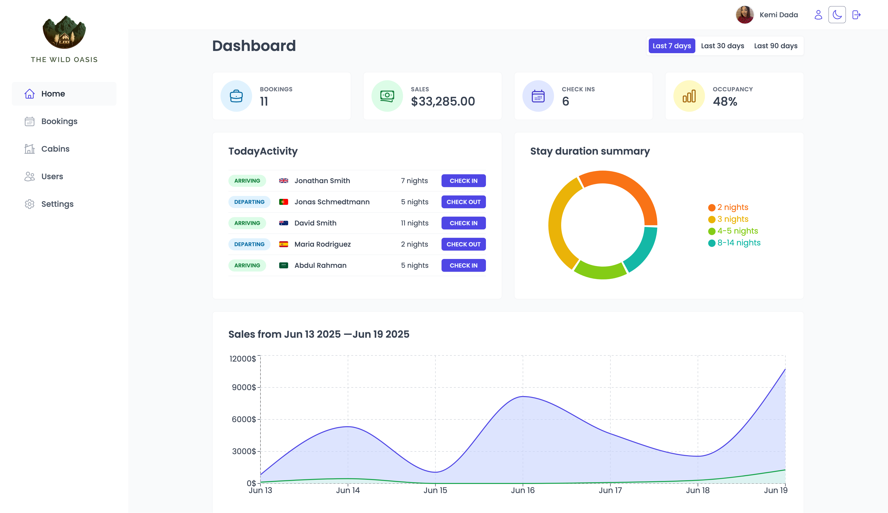

# The Wild Oasis

A full-featured hotel booking management app built with React and styled using styled-components.
The app demonstrates a real-world admin dashboard interface for managing bookings, cabins, guests, and app settings.

## Demo

<a href="https://the-wild-oasis-appp.netlify.app" target="_blank" rel="noopener noreferrer">Live Demo</a>

## Install dependencies

`npm install`

## Connect to Supabase

Create a Supabase project at supabase.com

Add the tables and schema

Rename example.env file to .env and fill accordingly:

## Start the development server

`npm run dev`

Uncomment the Uploader component in src/ui/Sidebar.jsx file.
Click on "Upload ALL" to upload sample data to supabase.
